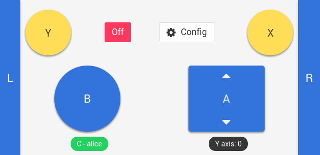
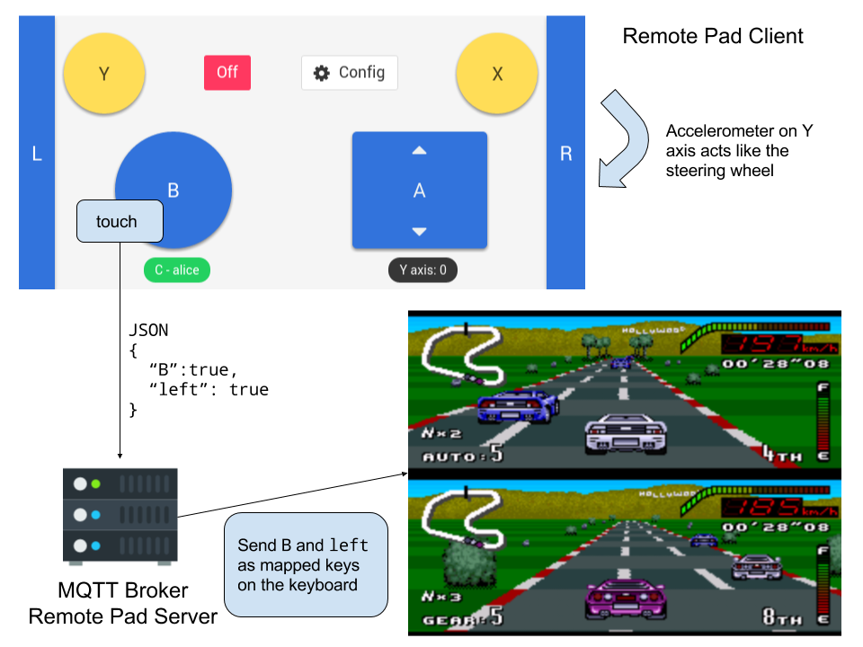
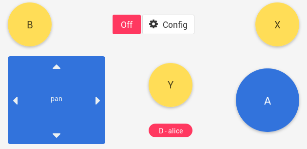

# Remote Pad

[](https://travis-ci.org/comsolid/remote-pad)
[](https://raw.githubusercontent.com/comsolid/remote-pad/master/LICENSE)

MQTT client running a [vue](https://vuejs.org) SPA that is supposed to send commands
as if it were the keyboard to a MQTT Broker
[remote-pad-server](https://github.com/comsolid/remote-pad-server).

The ideia is to create a virtual gamepad for example for a race game, like
Top Gear or Mario Kart 64, send commands to the server that will proper execute the keyboard
keys: left and right, A, B, etc.

## Race Pad page example



In the example the `Y axis` of the accelerometer is used as the input for left
and right. And the buttons are use to send the equivalent keys of a emulator input keys.



## Directional Pad



Good for games like SNES Bomberman, N64 Mario Tennis.

## Getting Started

You can install [Remote Pad GUI](https://github.com/comsolid/remote-pad-gui)
to start a desktop app.


A video of this application can be seen at https://www.youtube.com/watch?v=93f1dRWxhyc.

## Development

``` bash
# install dependencies
npm install # or yarn

# serve with hot reload at localhost:8080
npm run dev

# build for production with minification
npm run build

# run unit tests
npm run unit
```

## For production

### Install a proccess manager

```bash
sudo npm install pm2@latest -g
```

### Start the server

```bash
pm2 start production/process.yml
```

### Monitoring

```bash
pm2 monit
```
